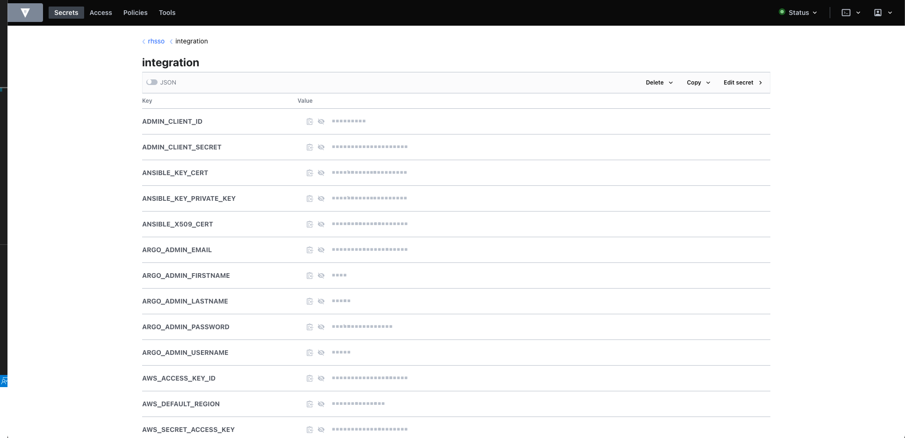

# Catalog of Operators and Instances Catalog for One Touch Provisioning asset

This git repository serves as a catalog/library of Operators and Instances of the custom resource(s) provided by the Operators for the [One Touch Provisioning](https://github.com/one-touch-provisioning/otp-gitops) asset.  The Operator and Instance YAMLs are package as a Helm Chart and can be referenced by ArgoCD Applications.

The Charts are hosted in the [Cloud Native Toolkit Helm Repository](https://github.com/cloud-native-toolkit/toolkit-charts).

## Instances

### Instana

The prerequisites to install the Instana agent are:  
    
1. Store your Instana Agent Key in a secret in the `instana-agent` namespace. The secret key field should contain `key` and the value contains your Instana Agent Key. Modify the `instana-agent.agent.keysSecret` value in the `instances\instana-agent\values.yaml` file to match the secret you deployed. 

1. Modify the `instana-agent.cluster.name` value in the `instances\instana-agent\values.yaml` file which represents the name that will be assigned to this cluster in Instana.

1. Modify the `instana-agent.zone.name` value in the `instances\instana-agent\values.yaml` file which is the custom zone that detected technologies will be assigned to.

## RHSSO integration
The prerequisites to install the RHSSO related integration jobs (`instances/rhsso-integration-*`)
1. There should be an vault setup, which will provides all the credentials for keycloak integration jobs

2. Create a secret for vault token, which is used to login the vault. Replace VAULT_TOKEN with token provided 
`oc create secret generic vault-token --from-literal=token=${VAULT_TOKEN} -n sso-integration`

3. External secret operartor should be ready

4. (Optional) Update the file `instances/rhsso-integration-preprocessing/kustomization.yaml` with proper `caBundle` value, and `server` path to the target vault if necessary. (The default is used)

5. Add a KV engine in the provided vault (Step 1) with path `rhsso/integration` like following image. All key-value paris are *REQUIRED* and explained in [rhsso-auto Integration with RHSSO Environment Variables](https://github.com/otp-demo/rhsso-auto#integration-with-rhsso-environment-variables) section under column `Location: sso-configs`. 

Note: For all values under column `Location` with value `argocd-configs`, they are automatically populated by the [pre-processing job](instances/rhsso-integration-preprocessing/keycloak-pre-processing-job.yaml) as a configmap in Openshift environment.

### RHSSO Operator and instance issues running on IBM Cloud
#### RHSSO Operator
 There is SCC user range restriction, which caused the following error when standing up the operator
```bash
Error creating: pods "keycloak-postgresql-6d46dbdb6b-" is forbidden: unable to validate against any security context constraint: [provider "anyuid": Forbidden: not usable by user or serviceaccount, provider "pipelines-scc": Forbidden: not usable by user or serviceaccount, provider "containerized-data-importer": Forbidden: not usable by user or serviceaccount, spec.initContainers[0].securityContext.runAsUser: Invalid value: 0: must be in the ranges: [1000800000, 1000809999], provider "ibm-restricted-scc": Forbidden: not usable by user or serviceaccount, provider "nonroot": Forbidden: not usable by user or serviceaccount, provider "noobaa": Forbidden: not usable by user or serviceaccount, provider "noobaa-endpoint": Forbidden: not usable by user or serviceaccount, provider "ibm-anyuid-scc": Forbidden: not usable by user or serviceaccount, provider "hostmount-anyuid": Forbidden: not usable by user or serviceaccount, provider "ibm-anyuid-hostpath-scc": Forbidden: not usable by user or serviceaccount, provider "bridge-marker": Forbidden: not usable by user or serviceaccount, provider "machine-api-termination-handler": Forbidden: not usable by user or serviceaccount, provider "kubevirt-controller": Forbidden: not usable by user or serviceaccount, provider "hostnetwork": Forbidden: not usable by user or serviceaccount, provider "hostaccess": Forbidden: not usable by user or serviceaccount, provider "ibm-anyuid-hostaccess-scc": Forbidden: not usable by user or serviceaccount, provider "linux-bridge": Forbidden: not usable by user or serviceaccount, provider "nmstate": Forbidden: not usable by user or 
```

To fix this: `oc adm policy add-scc-to-user anyuid system:serviceaccount:sso:default`

If the rhsso operator gitops runs a second time (delete the rhsso operator application and argocd spin up the operator again), you might see
```bash
clusterserviceversion exists and is not referenced by a subscription
``` 
This seems to be a bug with the version of csv and subscription not matching well.

To fix this, run `oc delete csv rhsso-operator.7.5.1-opr-005 -n sso`, and then delete the rhsso operator again. 

#### RHSSO instance
if error occurs on `keycloak-postgresql` pod 
```bash
mkdir cannot create directory permission denied
```
Patch the deployment `keycloak-postgresql` 
```bash
oc patch -n ${NAMESPACE} deployment/keycloak-postgresql -p '{"spec": {"template": {"spec": {"securityContext": {"runAsUser": 1000, "runAsNonRoot": true, "fsGroup": 2000}}}}}'
```
And wait for the deployment to kill and restart the pod, and operator will fix the rest of stuff

This has been automated in `otp-gitops-services/instances/rhsso-instance/base/patch-sc-postgre-job.yaml`